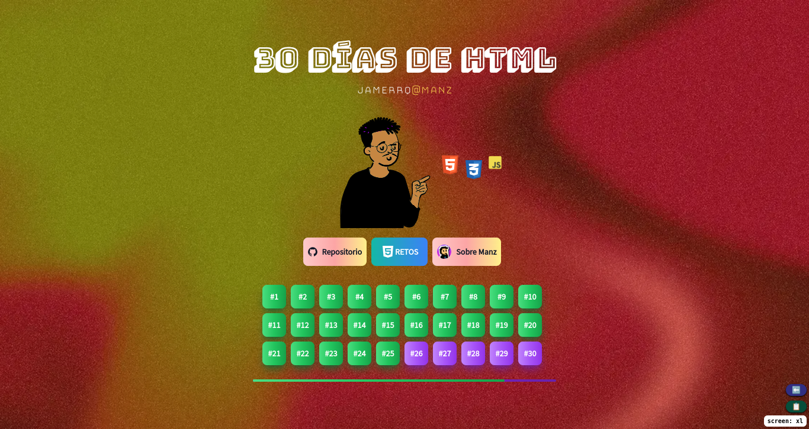

# HTML 30-day challenge

## Powered by

[Lumina](https://github.com/jamerrq/lumina) - Minimalist PWA Astro Starter Template

30 retos de HTML por @manz

https://lenguajehtml.com/challenge/

## UI Tasks

- [x] Prev and Next Challenge
- [ ] Mobile Design (Need changes)
- [x] Resizable Preview window
- [x] Level display
- [x] Synthax Highlighting
- [ ] Copy code buttons

## Other tasks

- [x] Modularize challenge creation (don't repeat yourself)
- [ ] Improve lighthouse metrics
